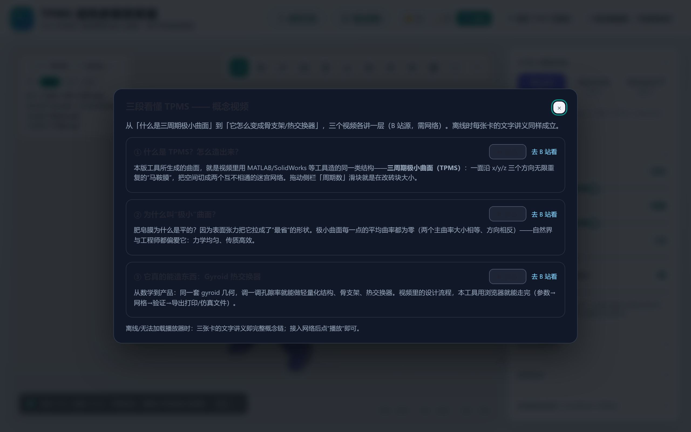
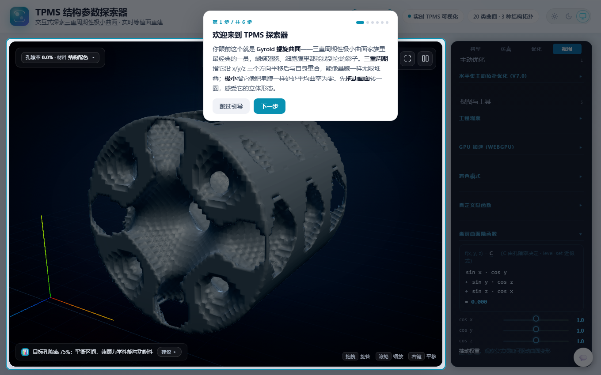
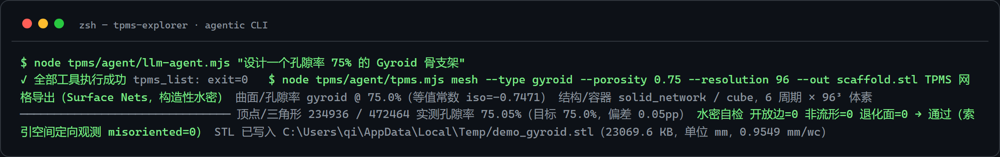

# TPMS Explorer — Interactive Triply Periodic Minimal Surfaces

> **English** · [中文](README.md)

An interactive, browser-based explorer for **Triply Periodic Minimal Surfaces (TPMS)** — the lattice geometries behind bone scaffolds, lightweight parts, heat exchangers and catalyst supports.
Personal, independently maintained open-source project.

**What makes it different: a verification-first culture.** Every formula, mesh and export path is guarded by **45 CI gates with 1,000+ assertions** (deterministic, pure-Node, cross-platform), anchored to analytic solutions — Poiseuille profile error 0.002 %, phononic Γ-point zero modes to machine precision, watertight STL by construction (open edges = 0 across 30 audit cases).

---

## Two editions

| | Single-file (`docs/`) | Engineering workstation (`tpms/tpms-platform/`) |
|---|---|---|
| Install | None — open `index.html`, works offline | `npm install && npm run dev` (Vite 8 + TS + Three.js + WebGPU) |
| Audience | Teaching, demos, quick exploration | Research, batch generation, CAE export, CLI automation |
| Status | **Feature-frozen teaching edition** (consistency/security fixes only; the only `file://` double-click build) | Active development — all v7+ capabilities live here |
| Surface families | 8 canonical | **24** (canonical + C2: Fischer-Koch / Double / Complementary D / Slotted P / F / Q* / W …) |
| Export | STL / PNG / glTF / OBJ / WebM | STL / VTK / VTI / 3MF / GLB / Abaqus INP / OpenFOAM polyMesh / Python (PyVista) / MATLAB scripts |
### Three-screen tour (live)

| Teaching: concept videos | Engineering: radial-grad M(r) card | Agent loop: NL → watertight delivery |
|---|---|---|
|  |  |  |

Live: [landing](https://zhaoliuxin926-ux.github.io/tpms-explorer/) | [teaching](https://zhaoliuxin926-ux.github.io/tpms-explorer/app.html) | [engineering](https://zhaoliuxin926-ux.github.io/tpms-explorer/platform/)


## AI Agent loop (M0-M5, fully wired)

**Natural language → schema-clamped interceptor → deterministic CLI → gate verification → bounded repair loop** — the LLM only fills intent slots; every number is generated or clamped by deterministic code:

```
"Design a 75%-porosity Gyroid bone scaffold"
   → [interceptor: per-slot enum/range/path-traversal validation, reject on violation]
   → tpms_mesh executes (constructively watertight Surface Nets)
   → watertight gate: open edges=0, non-manifold=0, degenerate=0 → PASS → STL delivered (mm)
```

| Acceptance | Result |
|---|---|
| 37 bilingual instructions | **glm-5.3-flash 37/37** (4-flash 33 / 4.6 35 / 5.3 36 — rotating single-item variance, all pass on rerun = pipeline defect-free) |
| Adversarial prompts (path traversal / out-of-range / injection) | **zero transmissions** across four models |
| The interceptor itself | 33 offline deterministic assertions (incl. live `../x.stl` traversal block) |
| Closed-loop driver | injected-defect designs converge in ≤5 rounds (LLM picks repair strategy only) |

Reproduce: `TPMS_LLM_TIMEOUT_MS=170000 node tpms/agent/llm-agent.mjs --provider openai --model glm-5.3-flash "design a 75% porosity gyroid scaffold"` (terminal demo = third panel of the three-screen tour above).

📘 **Technical narratives**: [44 Gates: Verification Methodology in the LLM Era](docs/blog/2026-09-16-44-gates.md) | [From One Sentence to Watertight STL: LLM Agent Security Architecture](docs/blog/2026-09-17-agent-architecture.md) | **Video demo (Bilibili, 104 s, CC subtitles)**: <https://www.bilibili.com/video/BV1hVeS6jEBM/>

## Highlights

- **24 TPMS families** (engineering): 8 canonical + C2 extensions (O,C-TO, Karcher, Fischer-Koch S/Y/C(S)/C(Y), G′, D′, Double P/D/G, Complementary D, Slotted P/F/Q*/W from the jwf23 equation dataset) with four-way formula parity and a public [BENCHMARKS](BENCHMARKS.md) usable-domain matrix. Teaching edition keeps the 8 canonical families for focus. **The teaching edition is feature-frozen** (since v9.2): it receives consistency/security fixes only, while all new capabilities land in the engineering edition.
- **Exact porosity solver** (CLI): analytic-integration root finding + mesh-measured secant validation. Measured deviation **0.26 pp @ R96** (diamond, 65 % target).
- **Watertight meshing pipeline**: edge-crossing Surface Nets with global orientation propagation — open edges, non-manifold and degenerate triangles are hard-failed before any STL is written.
- **Physics suite**: Gibson-Ashby stiffness/yield, permeability, tortuosity, homogenization (Voigt–Reuss bounds), phononic band gaps (Bloch–Floquet), tissue ingrowth (reaction–diffusion), LPBF thermo-mechanical, topology optimization, ML surrogate Pareto.
- **CAE direct-pass**: Abaqus INP (C3D8 + load steps + RF/U history output) and **runnable OpenFOAM cases** (SIMPLE steady dict set, embedded dP/WSS probes) straight from the browser — no snappyHexMesh. `cfd-post` turns two flow-rate runs into a Forchheimer separation: intrinsic permeability K_int = 2.34×10⁻⁹ m² (measured, in the bone-scaffold literature band) with a wall-shear mineralization-window check.
- **Bimodal region blending** (2026-09-17): two TPMS families in one domain (e.g. gyroid shell + diamond core) joined by a smoothstep convex combination; family zero-level-set reconnection is structurally non-manifold for Surface Nets (measured nm 20-52, blend-independent) → extracted via the Marching Tetrahedra pipeline (same rationale as radial-grad); one-shot UI card bit-identical to `mesh --region-inner`, with endpoint rSplit serving as byte-level single-family anchors (probe: 10 assertions; CLI matrix 8/8 watertight).
- **Dual mesh extractors** (v9.1): Surface Nets for smooth fields + **Marching Tetrahedra** for non-smooth fields — ships a **one-shot UI card** (MT preview at R48 + HD STL export at R96 behind a built-in watertight audit gate, bit-identical to the CLI) for the **radial-grad family** (center-dilated K / edge-1 metric remap with wall-thickness compensation, K∈[1,3], K=1.5 measured design density ≈50.6 %) to ship watertight STL across K = 1…2 (sphere anchor 4π/3 deviation 0.13 %).
- **Printability audit** (v9.1): overhang area statistics (α = arccos(−N·b) industrial convention) + deterministic Fibonacci-sphere build-orientation search. Measured: TPMS lattices are near-isotropic — orientation gain ≈ ±1 pp, a quantitative basis for leaving support control to the slicer.
- **Direct implicit slicing** (v9.0+): scan-line interval method → SVG layer paths + **CLI Common-Layer-Interface** industrial format (hatch-volume fidelity ≤0.1 %), container clipping included.
- **AI-friendly**: a deterministic CLI (`tpms/agent/`) with machine-readable JSON output and an agentic roadmap ([ROADMAP](tpms/agent/ROADMAP.md)) — the LLM never writes numbers, the gates decide. 37-case real-model regression (glm-5.3-flash 37/37 recommended; four-tier model profile on record).

## Quick start

**Online (zero install):** open the GitHub Pages site → *Start Exploring*.

**Local single-file:** double-click `docs/index.html` (Chrome/Edge).

**Engineering workstation:**

```bash
cd tpms/tpms-platform
npm install
npm run dev        # http://localhost:5173
```

**CLI (porosity → watertight STL, no browser):**

```bash
cd tpms/tpms-platform && npm install
node ../agent/tpms.mjs mesh --type gyroid --porosity 0.65 --out scaffold.stl
node ../agent/tpms.mjs estimate --type gyroid --porosity 0.65 --material tc4
```

## Verification

```bash
# Fast checks (seconds — pre-commit / pre-interview)
node tpms/agent/schema_check.mjs --fast           # contract/static/reject, 48 assertions
node tpms/.verify/docs_consistency_check.mjs      # docs number consistency, 44 assertions
node tpms/agent/sync-publish.mjs --check          # blog paste-sources not drifted

# Full geometry cross-check (includes R48–R128 probes, ~5–10 min)
node tpms/agent/schema_check.mjs                  # 106 assertions (guard baseline 98)
cd tpms/tpms-platform && npm run test:all   # 45/45 gates, ~6–10 min
```

Every gate prints a `RESULT` line and carries a minimum-assertion guard, so silently skipping assertions fails the build. See [docs/LEARNING_PATH.md](docs/LEARNING_PATH.md) for the guided path from "what is a minimal surface?" to research-grade workflows, and [docs/WORKFLOW_GUIDE.md](docs/WORKFLOW_GUIDE.md) (36 chapters) for AM/CFD/CAE practice.

## Status & scope honesty

Browser-side FEM/CFD modules are **engineering-grade analytic estimates** (literature-calibrated, instant), not Abaqus-grade solvers — the UI and docs keep the two registers separate, and one-command export to real solvers is built in.

---

*Independent open-source work, continuously maintained. Issues and PRs welcome.*
