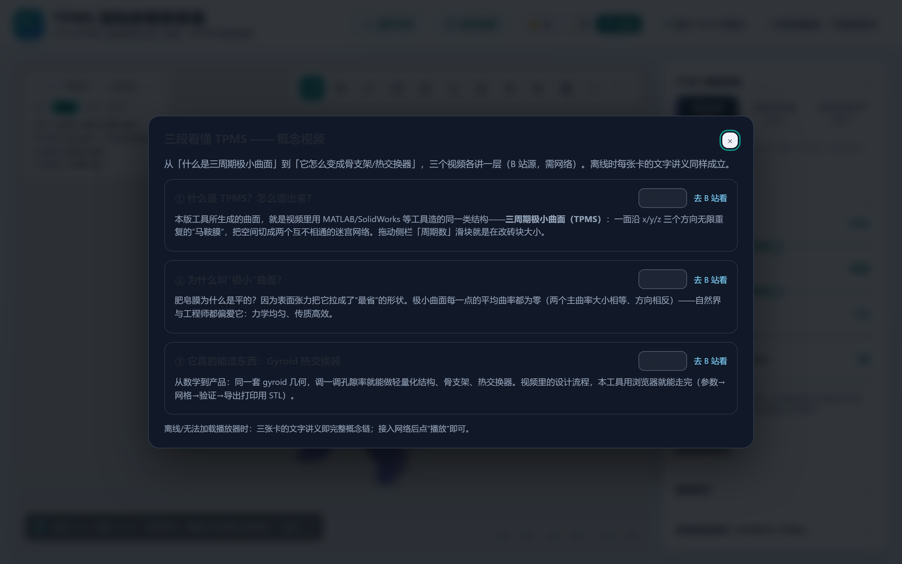
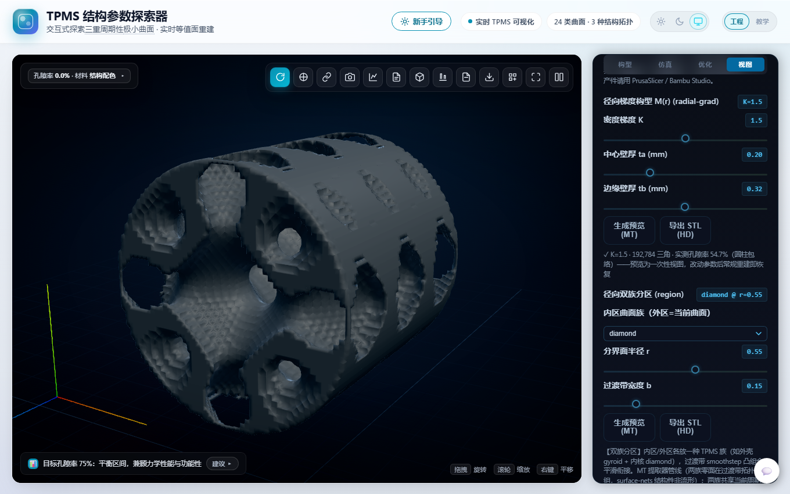
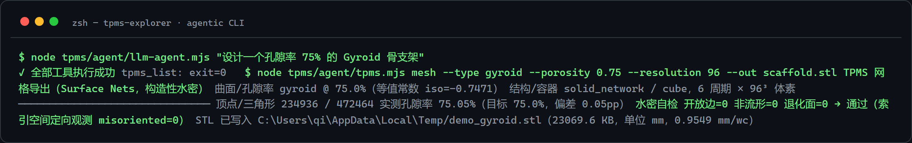

# TPMS Explorer — Interactive Triply Periodic Minimal Surfaces

> **English** · [中文](README.md)

An interactive, browser-based explorer for **Triply Periodic Minimal Surfaces (TPMS)** — the lattice geometries behind bone scaffolds, lightweight parts, heat exchangers and catalyst supports.
Personal, independently maintained open-source project.

**What makes it different: a verification-first culture.** Every formula, mesh and export path is guarded by **46 CI gates with 1,000+ assertions** (deterministic, pure-Node, cross-platform), anchored to analytic solutions — Poiseuille profile error 0.002 %, phononic Γ-point zero modes to machine precision, watertight STL by construction (open edges = 0 across 29 geometry cases (34 audit cases incl. reject sentinels)).

---

## Two editions

| | Single-file (`docs/`) | Engineering workstation (`tpms/tpms-platform/`) |
|---|---|---|
| Install | None — open `index.html`, works offline | `npm install && npm run dev` (Vite 8 + TS + Three.js + WebGPU) |
| Audience | Teaching, demos, quick exploration | Research, batch generation, CAE export, CLI automation |
| Status | **Feature-frozen teaching edition** (consistency/security fixes only; the only `file://` double-click build) | Active development — all v7+ capabilities live here |
| Surface families | 8 canonical | **26** (canonical + C2: Fischer-Koch / Double / Complementary D / Slotted P / F / Q* / W … + strut trusses BCC/Octet) |
| Export | STL / PNG / glTF / OBJ / WebM | STL / VTK / VTI / 3MF / GLB / Abaqus INP / OpenFOAM polyMesh / Python (PyVista) / MATLAB scripts |
### Three-screen tour (live)

| Teaching: concept videos | Engineering: radial-grad M(r) card | Agent loop: NL → watertight delivery |
|---|---|---|
|  |  |  |

Live: [landing](https://zhaoliuxin926-ux.github.io/tpms-explorer/) | [teaching](https://zhaoliuxin926-ux.github.io/tpms-explorer/app.html) | [engineering](https://zhaoliuxin926-ux.github.io/tpms-explorer/platform/)


## AI Agent loop (M0-M5, fully wired)

**Natural language → schema-validating interceptor (reject on violation) → deterministic CLI → gate verification → bounded repair loop** — the LLM only fills intent slots; every number is generated or validated by deterministic code. **Six tools** incl. `tpms_pareto` inverse design ("I need E≥2 GPa and κ≥5e-9 — which family?" → top-k designs; CLI: `node tpms/agent/tpms.mjs pareto --target-e 2 --target-k 5`):

```
"Design a 75%-porosity Gyroid bone scaffold"
   → [interceptor: per-slot enum/range/path-traversal validation, reject on violation]
   → tpms_mesh executes (constructively watertight Surface Nets)
   → watertight gate: open edges=0, non-manifold=0, degenerate=0 → PASS → STL delivered (mm)
```

| Acceptance | Result |
|---|---|
| 43 bilingual instructions | **glm-5.3-flash 43/43 ×2 rounds** (n=2, not claimed deterministic; 6/6 endpoint×model matrix on record; H-group inverse-design intents added 2026-10-06) |
| Adversarial prompts (path traversal / out-of-range / injection) | **zero transmissions** across four models |
| The interceptor itself | 39 offline deterministic assertions (guard 37; incl. live `../x.stl` traversal block, toolCalls cap, Anthropic-channel provider) |
| Closed-loop driver | injected-defect designs converge in ≤5 rounds (LLM picks repair strategy only) |

Reproduce (GLM Coding Plan subscription — the Anthropic-compatible channel, see [LLM_REGRESSION_LIVE](docs/LLM_REGRESSION_LIVE.md)): `TPMS_LLM_TIMEOUT_MS=170000 TPMS_LLM_BASE_URL=https://open.bigmodel.cn/api/anthropic node tpms/agent/llm-agent.mjs --provider anthropic --model glm-5.3 "design a 75% porosity gyroid scaffold"` (terminal demo = third panel of the three-screen tour above).

📘 **Technical narratives**: [44 Gates: Verification Methodology in the LLM Era](docs/blog/2026-09-16-44-gates.md) (published: [Juejin](https://juejin.cn/post/7691244760439439414) | [Zhihu](https://zhuanlan.zhihu.com/p/2089373962224538897)) | [From One Sentence to Watertight STL: LLM Agent Security Architecture](docs/blog/2026-09-17-agent-architecture.md) (published: [Juejin](https://juejin.cn/post/7692881705648685097) | [Zhihu](https://zhuanlan.zhihu.com/p/2090752932518151852)) | [Your WGSL Was Never Executed](docs/blog/2026-09-30-wgsl-never-executed.md) (published: [Juejin](https://juejin.cn/post/7692977150127259711) | [Zhihu](https://zhuanlan.zhihu.com/p/2090753535692612246)) | **Video demo (Bilibili, 104 s, CC subtitles)**: <https://www.bilibili.com/video/BV1hVeS6jEBM/>

## Highlights

- **26 families** (engineering): 24 TPMS (8 canonical + C2 extensions (O,C-TO, Karcher, Fischer-Koch S/Y/C(S)/C(Y), G′, D′, Double P/D/G, Complementary D, Slotted P/F/Q*/W from the jwf23 equation dataset)) + **2 strut-truss families** (BCC bending-dominated / Octet stretch-dominated — struts as capsule-SDF periodic fields, zero architecture change downstream) + a **26-family gallery** (one-screen same-parameter thumbnails, click to switch), with four-way formula parity and a public [BENCHMARKS](BENCHMARKS.md) usable-domain matrix. Teaching edition keeps the 8 canonical families for focus. **The teaching edition is feature-frozen** (since v9.2): it receives consistency/security fixes only, while all new capabilities land in the engineering edition.
- **Exact porosity solver** (CLI): root finding on the analytic surface via deterministic seeded Monte-Carlo integration + mesh-measured secant validation. Measured deviation **0.13 pp @ R96** (diamond, 60 % target).
- **Watertight meshing pipeline**: edge-crossing Surface Nets with global orientation propagation — open edges, non-manifold and degenerate triangles are hard-failed before any STL is written.
- **Physics suite**: Gibson-Ashby stiffness/yield, permeability, tortuosity, homogenization (Voigt–Reuss bounds), phononic band gaps (Bloch–Floquet), tissue ingrowth (reaction–diffusion), LPBF thermo-mechanical, topology optimization, ML surrogate Pareto.
- **Pareto front explorer** (2026-10-04): the bone-scaffold trilemma (E↑ mechanics × κ↑ transport × Sv↑ bioactivity) — millisecond analytical-proxy scan over 26 families × porosity × density → non-dominated front on a log-log canvas → hover readouts → **click to write design parameters back**; constraint filtering (front recomputed on the feasible subset, not a naive filter) + front CSV export + dual-family hybrid blending (E/Sv convex combination, κ recomputed via Kozeny–Carman; b=0/1 degenerates to single families) + **inverse-design recommendation** (enter target E/κ → minimal-overrun feasible points when the target is attainable, nearest top-3 compromises when not, ★ target marker with log10 distances). Gate: ml_pareto_audit 16 assertions.
- **CAE direct-pass**: Abaqus INP (C3D8 + load steps + RF/U history output) and **runnable OpenFOAM cases** (SIMPLE steady dict set, embedded dP/WSS probes) straight from the browser — no snappyHexMesh. `cfd-post` turns two flow-rate runs into a Forchheimer separation: intrinsic permeability K_int = 2.34×10⁻⁹ m² (measured, in the bone-scaffold literature band) with a wall-shear mineralization-window check.
- **Bimodal region blending** (2026-09-17): two TPMS families in one domain (e.g. gyroid shell + diamond core) joined by a smoothstep convex combination; family zero-level-set reconnection is structurally non-manifold for Surface Nets (measured nm 20-52, blend-independent) → extracted via the Marching Tetrahedra pipeline (same rationale as radial-grad); one-shot UI card bit-identical to `mesh --region-inner`, with endpoint rSplit serving as byte-level single-family anchors (probe: 10 assertions; CLI matrix 8/8 watertight).
- **Dual mesh extractors** (v9.1): Surface Nets for smooth fields + **Marching Tetrahedra** for non-smooth fields — ships a **one-shot UI card** (MT preview at R48 + HD STL export at R96 behind a built-in watertight audit gate, bit-identical to the CLI) for the **radial-grad family** (center-dilated K / edge-1 metric remap with wall-thickness compensation, K∈[1,3], K=1.5 measured design density ≈54.7 % (192,784 tris, v9.2 bit-exact wording)) to ship watertight STL across K = 1…2 (sphere anchor 4π/3 deviation 0.13 %).
- **Printability audit** (v9.1): overhang area statistics (α = arccos(−N·b) industrial convention) + deterministic Fibonacci-sphere build-orientation search. Measured: TPMS lattices are near-isotropic — orientation gain ≈ ±1 pp, a quantitative basis for leaving support control to the slicer.
- **Direct implicit slicing** (v9.0+): scan-line interval method → SVG layer paths + **CLI Common-Layer-Interface** industrial format (hatch-volume fidelity ≤0.1 %), container clipping included.
- **AI-friendly**: a deterministic CLI (`tpms/agent/`) with machine-readable JSON output and an agentic roadmap ([ROADMAP](tpms/agent/ROADMAP.md)) — the LLM never writes numbers, the gates decide. 43-case real-model regression (glm-5.3-flash 43/43 ×2 rounds, n=2, not claimed deterministic; 6/6 endpoint×model matrix on record).

## Quick start

**Online (zero install):** open the GitHub Pages site → *Start Exploring*.

**Local single-file:** double-click `docs/index.html` (Chrome/Edge).

**Engineering workstation:**

```bash
cd tpms/tpms-platform
npm install
npm run dev        # http://localhost:5173
```

**CLI (porosity → watertight STL, no browser):**

```bash
cd tpms/tpms-platform && npm install
node ../agent/tpms.mjs mesh --type gyroid --porosity 0.65 --out scaffold.stl
node ../agent/tpms.mjs estimate --type gyroid --porosity 0.65 --material tc4
```

**Self-verify in 60 seconds (no `npm install` needed — both gates are pure `node:fs`):**

```bash
git clone --depth 1 https://github.com/zhaoliuxin926-ux/tpms-explorer && cd tpms-explorer
node tpms/.verify/guard_audit.mjs            # meta-gate: audits the gates themselves (~2s)
node tpms/.verify/docs_consistency_check.mjs # doc-number consistency, 331 assertions (~10s)
```

The 46-gate badge is not a claim — these two commands let you watch the gate suite audit itself.

## Quick links

- [QUICKSTART](docs/QUICKSTART.md) — 5-minute first STL
- [CONTRIBUTING.md](CONTRIBUTING.md) — gates & PR checklist
- [ROADMAP](docs/ROADMAP.md) — decided directions & explicit non-goals
- [SECURITY.md](SECURITY.md) — vulnerability reporting
- [HONESTY_BOUNDARIES.md](docs/HONESTY_BOUNDARIES.md) — declared limits
- [LAB_ONE_PAGER.md](docs/LAB_ONE_PAGER.md) — print & test card
- [regression-matrix.md](docs/regression-matrix.md) — interceptor coverage matrix
- [LIT_BAND_CARD.md](docs/LIT_BAND_CARD.md) — literature band deviation card

## Verification

```bash
# Fast checks (seconds — pre-commit / pre-interview)
node tpms/agent/schema_check.mjs --fast           # contract/static/reject (GUARD 40)
node tpms/.verify/docs_consistency_check.mjs      # docs number consistency, 331 assertions (guard 313)
node tpms/agent/sync-publish.mjs --check          # blog paste-sources not drifted

# Full geometry cross-check (includes R48–R128 probes, ~5–10 min)
node tpms/agent/schema_check.mjs                  # 113 assertions (guard baseline 98)
cd tpms/tpms-platform && npm run test:all   # 46/46 gates, ~6–10 min
```

Every gate carries a minimum guard (assertion count or case count, depending on the gate; summary-line formats vary), so silently skipping assertions fails the build. See [docs/LEARNING_PATH.md](docs/LEARNING_PATH.md) for the guided path from "what is a minimal surface?" to research-grade workflows, and [docs/WORKFLOW_GUIDE.md](docs/WORKFLOW_GUIDE.md) (37 chapters) for AM/CFD/CAE practice.

## Status & scope honesty

Browser-side FEM/CFD modules are **engineering-grade analytic estimates** (literature-calibrated, instant), not Abaqus-grade solvers — the UI and docs keep the two registers separate, and one-command export to real solvers is built in.

---

*Independent open-source work, continuously maintained. Issues and PRs welcome.*
