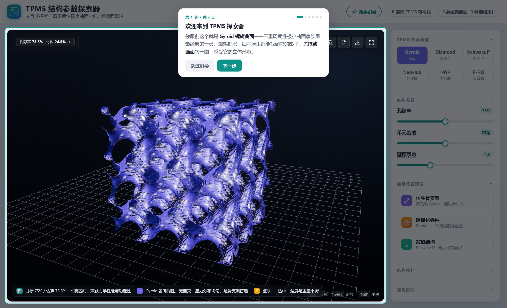
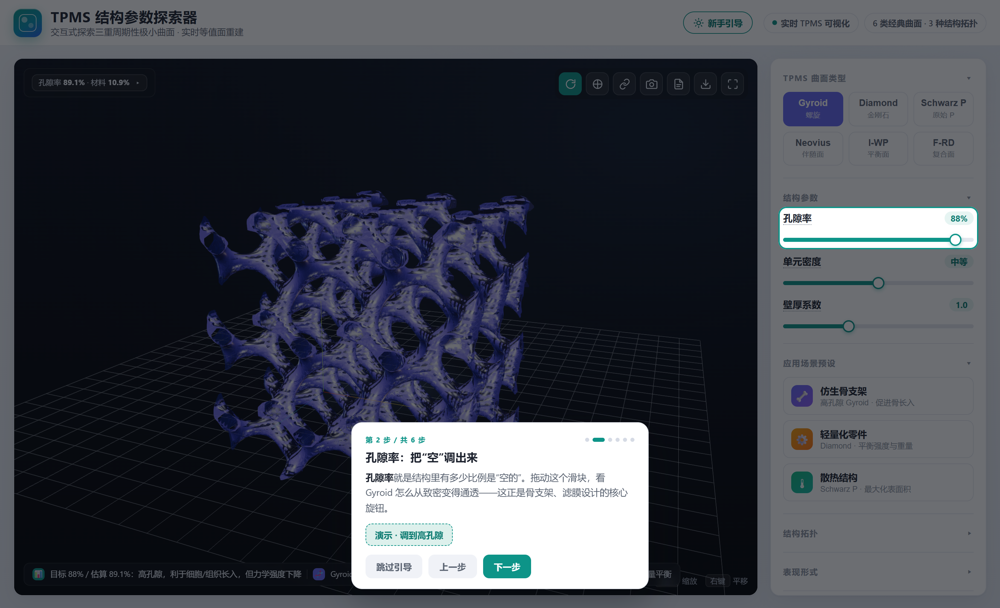
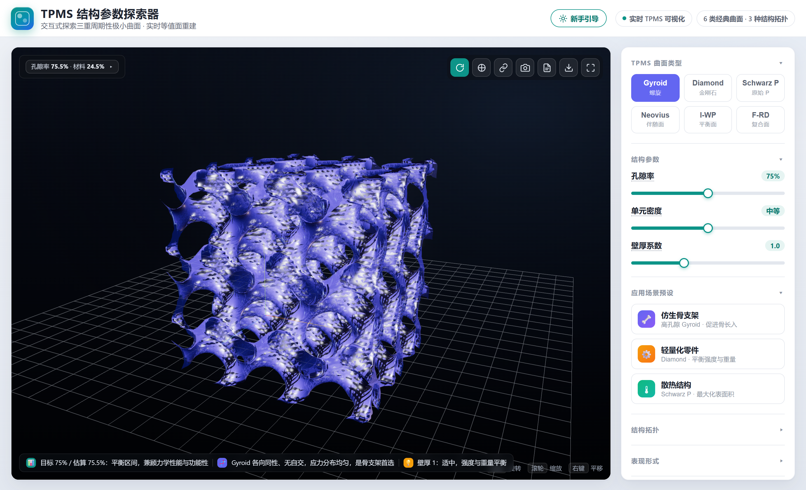
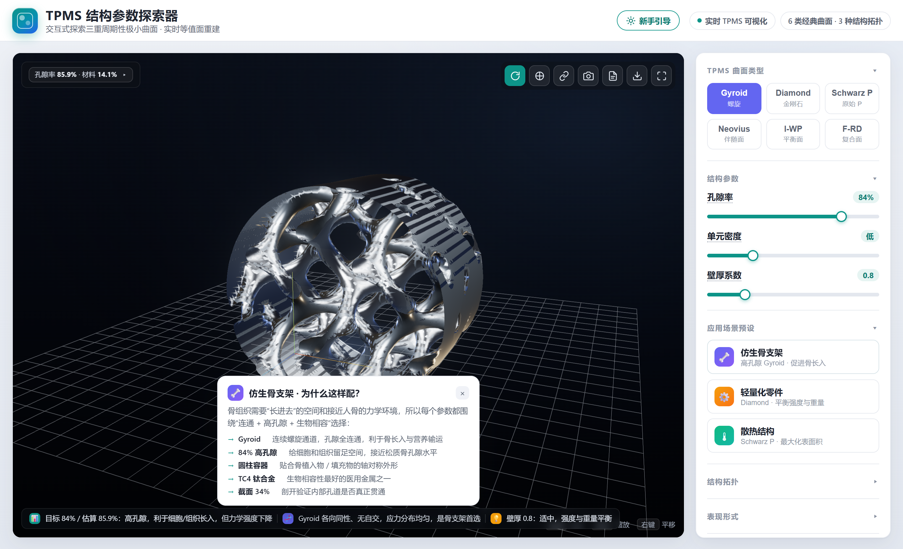
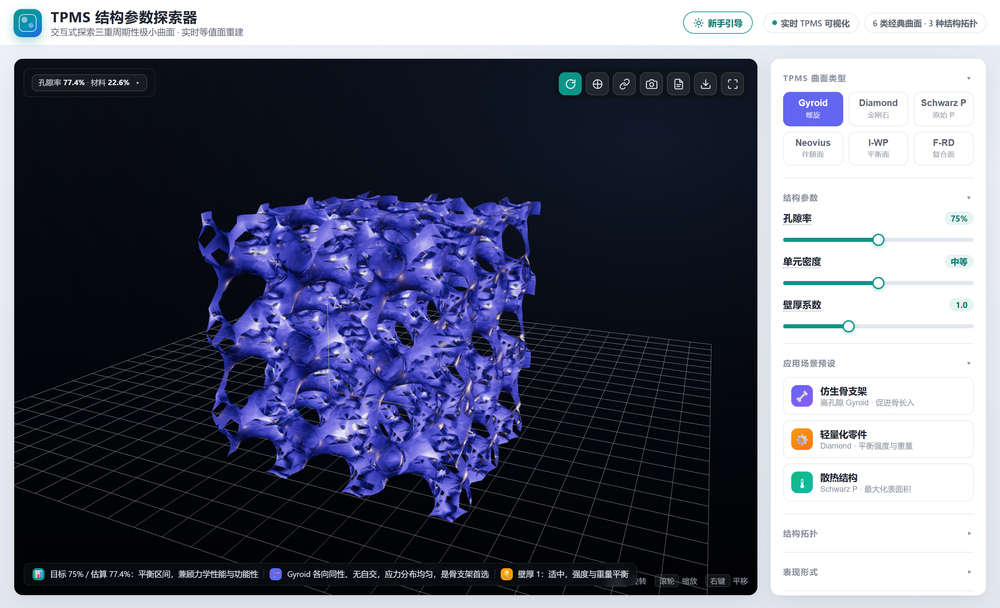
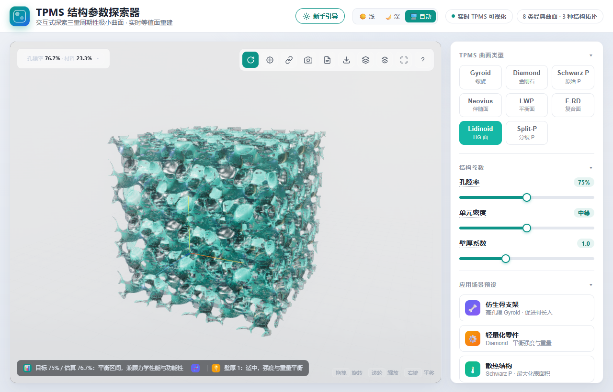
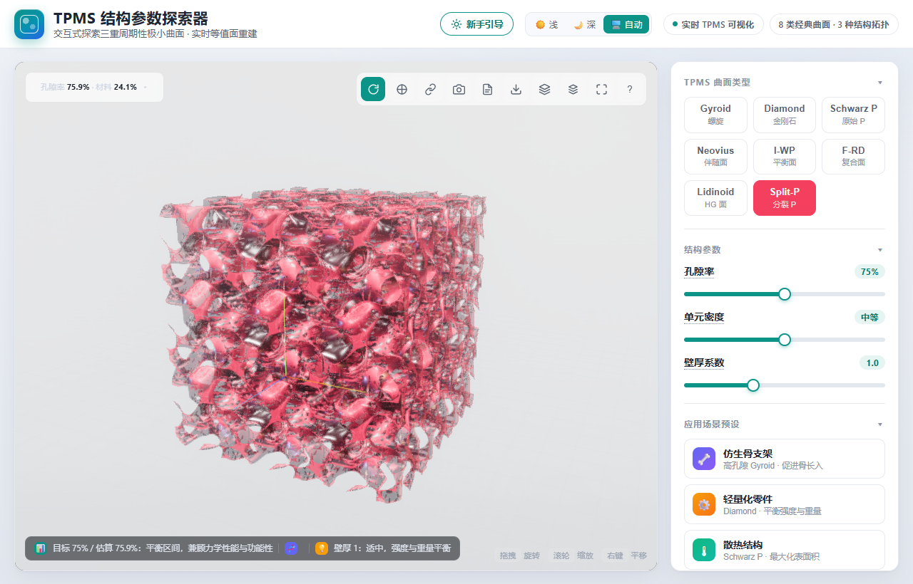
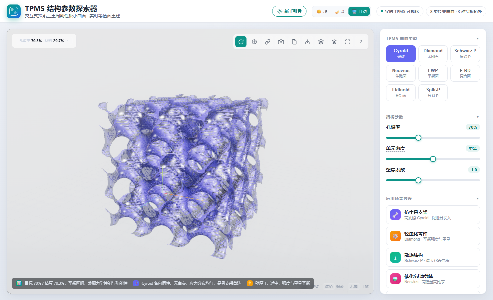

# TPMS 结构参数探索器

> 一个可交互的**三重周期极小曲面（TPMS, Triply Periodic Minimal Surfaces）**参数探索器。
> 个人长期维护的独立开源项目，目标是帮初学者（师弟师妹、跨领域学习者）在 5 分钟内直观理解这个看上去很"数学"的全新领域。

---

## 这个项目解决什么问题

极小曲面是材料、建筑、生物力学里极其重要的结构（骨支架、轻量化零件、散热通道都建立在它之上），
但传统教材要么满屏公式、要么只有静态图片，初学者根本"看不懂、动不了"。

本项目把 8 类经典 TPMS 曲面（Gyroid / Diamond / Schwarz P / Neovius / I-W-P / F-RD / Lidinoid / Split-P）做成了**实时可拖拽的参数沙盘**：
拖动滑块 → 曲面实时重建 → 公式同步变化 → 术语随时解释。从"我背不下这个公式"变成"哦，原来每一项都在捏这个形状"。

> 项目定位：由个人主导、持续打磨的**独立作品**，不依附于任何比赛或外部评审。欢迎 issue / PR 共同完善。

---

## 目录结构

```
tpms/
├── README.md                  ← 你正在看的项目中枢
│
├── web/                       ← 主交付：单文件版（双击即开，无构建）
│   ├── index.html             ← 落地页（项目介绍 + 展示图）
│   ├── app.html               ← 主应用（Three.js 0.160 CDN，Surface Nets 重建）
│   ├── README-体验说明.md     ← 单文件版使用说明
│   └── shots/                 ← 展示截图
│       ├── 01~05 官方展示图   ← 被落地页引用，勿移
│       ├── showcase/            ← 交互场景实拍（新手引导 / 公式演示 / 主视图 / 骨支架 / 公式系数）
│       └── verify/            ← 自动化验证截图（过程产物）
│
├── tpms-platform/             ← 工程化进阶版（Vite 8 + TS 6 严格模式 + Three 0.185）
│   └── 30 个源文件 · Web Worker 重建 · 7 种导出格式
│
├── prototypes/                ← MATLAB 早期原型（已归档，TPMS_Studio_Stable.m）
├── agent_memory/              ← 项目记忆：context / progress / bugs / 审计报告（gitignored）
├── .verify/                   ← Playwright 验证脚本（gitignored）
├── .diag/                     ← 诊断探针脚本（gitignored）
└── .zcode/                    ← 计划文件（gitignored）
```

---

## 两个版本怎么选

| | 单文件版 `web/` | 工程版 `tpms-platform/` |
|---|---|---|
| **定位** | 主交付 · 双击即开 | 进阶研究 / 批量导出 |
| **构建** | 无（纯 HTML + CDN） | `npm install && npm run dev` |
| **导出** | STL / PNG / glTF / OBJ / WebM | STL / VTK / VTI / Python / MATLAB / BibTeX / JSON |
| **性能** | 拖动低清预览、松手高清 | Web Worker 并行 + 多级 LOD |
| **适合** | 演示、分享链接 | 科研复现、参数批量生成 |

> 单文件版刻意保持零构建：一个 `index.html` 双击即可运行，便于本地打开与静态部署。

---

## 界面预览

新手引导首屏（教学引导 + 3D 实时预览）：


公式权重演示（拖动滑块，公式同步变化）：


主界面 3D 视图（完整控制面板 + 实时重建）：


仿生骨支架预设（场景卡弹出"为什么这样配"）：


公式权重（带系数显示，抽象数学可见）：


新曲面族 Lidinoid（左）与 Split-P（右）：



浅 / 深 / 自动主题切换（浅色主题）：


---

## 快速开始

### 单文件版（推荐先看这个）
1. 用 Chrome / Edge 打开 `web/index.html`（落地页）→ 点"开始探索"进入 `web/app.html`。
2. 首次进入会弹出 6 步新手引导；右侧控制面板各分区可折叠，左上角状态栏默认收起（点击展开）。
3. 详见 `web/README-体验说明.md`。

### 工程版
```bash
cd tpms-platform
npm install
npm run dev      # 访问 http://localhost:5173
# 或 npm run build && npm run preview
```

---

## 核心能力（单文件版）
- **8 类曲面**：Gyroid / Diamond / Schwarz P / Neovius / I-W-P / F-RD / Lidinoid / Split-P。
- **公式权重交互**：逐项拖动隐函数的数学项权重，公式实时渲染，直观看到"每一项如何塑形"。
- **参数沙盘**：孔隙率、单元密度、壁厚系数、截面扫描、梯度结构、等值常数 C。
- **结构拓扑**：实体网络 / 等厚双壳 / 梯度双壳；容器支持立方体 / 圆柱体。
- **教学六层**：A 新手引导 · B 公式权重交互 · C 术语解释卡 · D 预设场景卡（为什么这样配） · E 主题切换（浅/深/自动） · F 快捷键帮助。
- **导出分享**：复制参数链接、保存 PNG、导出 STL（可直接 3D 打印）、导出 glTF (.glb) / OBJ（可导入 Blender / CAD）、全屏。

---

## 技术要点
- **Surface Nets 等值面重建**：自研替代 Marching Cubes，避免 256 条查找表，天然三角网更轻。
- **孔隙率二分搜索**：在目标孔隙率下反解等值常数 C，所见即所得。
- **渐进式重建**：拖动滑块低分辨率预览，松手后高清重建，保证 60fps 交互。
- **零依赖交付**：单文件版仅依赖 Three.js CDN，开箱即用。

---

## 路线图（持续打磨中）
- [x] 更多曲面族与教学案例：新增 Lidinoid、Split-P 两族，以及催化 / 声学 / 电池电极 3 个场景预设。
- [x] 导出格式扩展：新增 glTF (.glb) + OBJ 导出。
- [x] 交互细节与无障碍：滑块 ARIA、按钮 aria-pressed、键盘快捷键帮助层、`prefers-reduced-motion` 适配、浅/深/自动主题切换。
- [ ] 文档与示例丰富：持续补充截图、公式说明与典型科研/教学使用案例。

> 这是一个长期维护的个人项目。如果你觉得有用，或有想加的功能 / 发现的 bug，欢迎参与共建。
